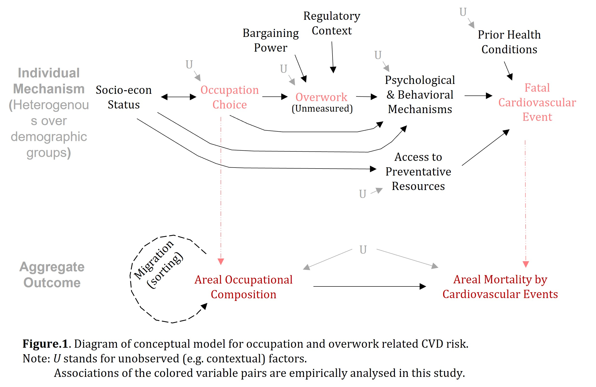
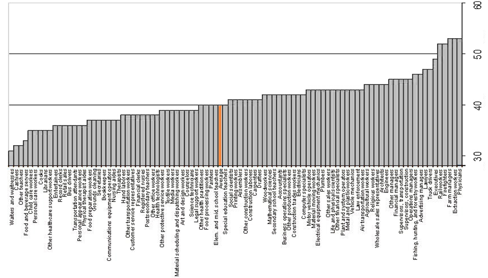
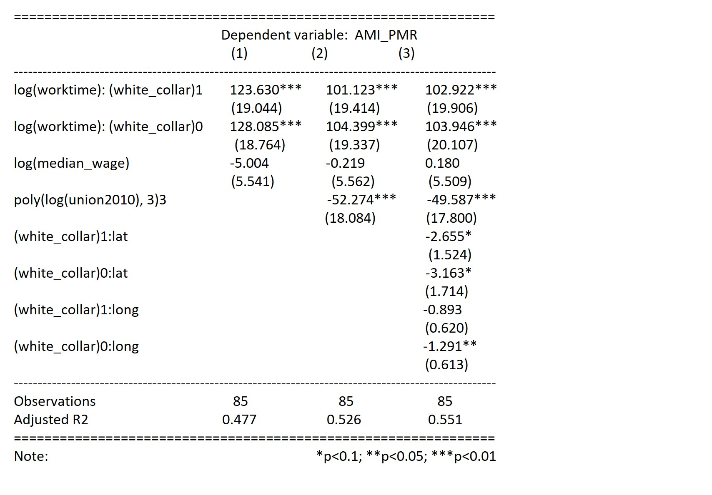
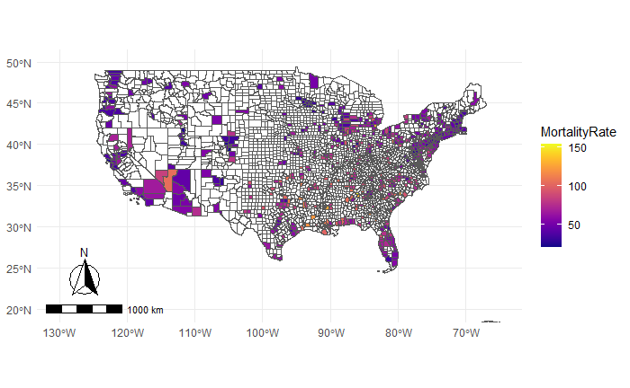
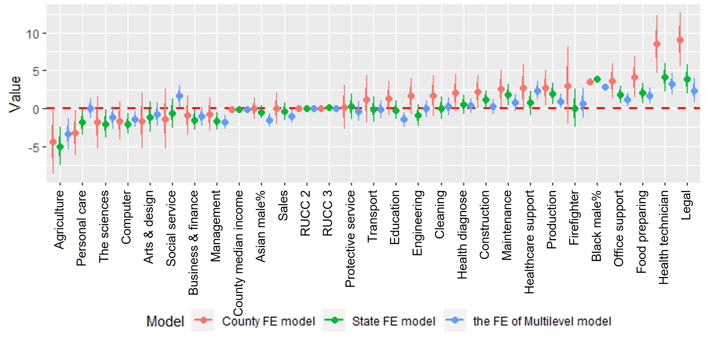

```{r setup, include=FALSE}
knitr::opts_chunk$set(echo = TRUE)
```


```{r,include=FALSE, message=FALSE, warning=FALSE,eval=FALSE}
library(dplyr)
library(readr)
library(readxl)
library(corrplot)
library(corrgram)
library(tinytex)
library(rticles)
library(tidyverse)
library(viridis)
library(RColorBrewer)
library(data.table)
library(ggplot2)
library(cdlTools)
library(stargazer)
library(DescTools)
library(lme4)
library(plm)
library(coefplot)
library(tigris)
library(ggspatial)
library(arm)
```


wordcount: 1996


“…time has become a currency, which we ‘spend’ instead of ‘pass’. Many of us need 
to relax, to unwind, and, yes, to work less … the market system handed down to
human beings a sentence of ‘life at hard labor’.”
—— Juliet Schor (1991) The Overwork American     


# I. Introduction
## 1.1 Long working hours and health outcomes
Since late 20th century, the gears that had historically produced a decrease in working hours have reversed. Workers’ bargaining power is weakening; productivity growth has stalled. In the US, masked behind a decreasing average work time is a polarization. Jacobs and Gerson (2000; 2004) revealed in their analyses that working time in the US had been going through a bifurcation since the 1990s, with an increase in both informal jobs on very short hours and full-time jobs demanding very long hours. Extremely long working time is found particularly common among workers with a tertiary degree. Similar findings have been replicated in several later studies (e.g. Burger, 2015; Johnson & Lipscomb, 2006 )

The public health outcome of overwork (>55 hours/week as defined by the WHO) is devastating (Goh, Pfeffer & Zenios, 2016). Latest research discovered a rising mortality rates in US working age population (Becker, Majmundar & Harris, 2021), for which overwork may be a contributor. According to Pega et.al (2021), the number of deaths attributable to overwork amount to roughly a 0.002% mortality rate in the US in 2016. It is also concerning that such deaths involve health inequalities across population strata and geographic regions (Essa et.al., 2021; Limdi et.al., 2016; Murray et.al., 2006), which tend to reinforce other forms of socio-economic inequalities. 

Over the years, we have accumulated socio-medical knowledge on overwork related health hazards. Meta-analyses show a link between long work hours and a 1.1~1.2 fold increased risk of cardiovascular diseases (Virtanen & Kivimäki, 2018). The evidence is underlined by clinical knowledge of the psychological, behavioral, and biological mechanisms linking long working hours to cardiac events (e.g. Bannai & Tamakoshi, 2014; Wong, Chan & Ngan, 2019). Despite this progress, it is often difficult to go one step further and question the contribution of overwork to actual mortalities. The causal chain from overwork to morbidity to mortality is long, and the rare events of such deaths difficult to systematically surveille. 

## 1.2 Research objectives
Recent evidence on overwork related mortality in the US is thin. This study intends to add to the literature by bringing a particular focus on the US urban work force. For cause of death, the focus is on acute cardiovascular event relate deaths (CVD). The hypothesis is: the extent of overwork offers significant explanation for the cross occupational variation in CVD mortality rates, which also drives areal variations in CVD. The empirical questions are: (1) Does length of work time predict cross occupation variations in cardiovascular disease related mortality rates? (2) Does this translate to geographic patterns of CVD mortality? In the rest of the essay, we first introduce the conceptual model and data sources, and then present the two sets of analysis. The repo is here.

# II. Approaches and data
## 2.1 Conceptual perspective
The conceptual assumptions are summarized in Figure.1. There are three main messages. (1) A lot of complexities lie in the multiple mechanisms linking overwork to CVD, while the relation between overwork and CVD is arguably less confounded than one might expect. (2) Occupational choice stands in as a proxy for overwork, if we assume it to be a main source of variation for working time. (Note that it’s not a valid instrumental variable.) (3) A major confounder at the individual level is socio-economic status that could impact life expectancy through occupation choice as well as through other channels. This is further complicated by the feedback between the two variables unfolded throughout the life course of an individual. 



## 2.2 Data sources
Based on the conceptual perspective, interventionist or counterfactual measures of causality cannot be obtained from observational data. Instead, with records on occupational and county level mortality rates, we can analyze the relations between occupation, overwork and CVD at aggregated levels. Three main data sources are used: the National Occupational Mortality Surveillance (NOMS), the Wide-ranging Online Data for Epidemiologic Research (WONDER), and various products based on the Current Population Survey (CPS).

### (1)	Records of mortality: NOMS and WONDER
Information in both datasets originate from death certificates. NOMS is a record of death counts tabulated by occupation and cause of death, with a summary of age adjusted proportional mortality rates (PMR) across occupations. WONDER contains the cause of death and geographic reference for the place of death, with a summary of age adjusted mortality rates (MR) across counties. Surveillance based data has certain advantages over surveys for this study, as survey based occupational health datasets typically have a survivors’ bias built in (Robinson, 2015). 

### (2)	Sources for main explanatory variables
Demographic datasets and occupational compositions for the US urban counties are taken from public datasets from the Census Bureau and the Bureau of Labor Statistics. Average weekly working hours by occupation is based on CPS estimates. 


# III. Analyses and discussions
## 3.1 Overwork and excessive mortality, occupation level patterns
Does length of work time predict cross occupation variations in cardiovascular disease related mortality rates? We approach this question with a cross-occupation regression with the form:


$$ PMR = {BlueCollar:WorkHour + Wage+Union+BlueCollar:Geo + \epsilon}$$

The observations are the 92 minor classes of occupations. The response variable is the average age adjusted acute myocardial infarction PMR (AMI_PMR) for each occupation for the period 1999-2016. AMI is the most common direct cause of heart failure and CVD. The main explanatory variable is average working hour per week in full-time employment, see Figure 2. The control variables are median annual wages, unionization rates, and a binary indicator of whether the occupation is 1: white-collar or 0: blue-collar. Interaction terms are included whereas appropriate based on examining the data.

In this regression, we cannot control for the geography of employments. To address this, we devise a simple test on whether there is an implicit geographic element. The idea is to represent the geographic distribution of employments for a given occupation by a single point on the map. The location of this point is taken as a crude indicator of the occupation’s geographic distribution. If this indicator is a significant predictor of a given occupation’s mortality rates, we say that the whereabouts of employment probably matters for its health outcomes. To construct this representation, the barycenter of employments is used, calculated from state level employment sizes and centroids of the states.

The results for occupation level analysis are reported in Table.1. Some trends are shared by all occupations. We can see that work time is a significant predictor of PMR. On average, a 1 log point increase in weekly total working hours is associated with a roughly 100-point increase in AMI_PMR. This relation between work time and mortality is consistent across white-collar and blue-collar jobs. The occupations with the longest work time (e.g. Physicians, lawyers, managers, extraction workers, firefighters, rail workers) also have relatively high AMI_PMR. This fits our understanding of overwork as a contributor to CVD mortality. One may suspect that conditional on work time, a higher wage will be associate with a lower mortality rate. The results here suggest otherwise. Annual wage is not significantly associated with the PMR after controlling for work time.

The geographic factor is negatively associated with mortality rates for both white- and blue-collar jobs, while the effect is more significant among blue-collar jobs. This means that a higher weight of employments in the south and east of US is associated with a higher mortality for an occupation. This trend agrees with our existing knowledge on the geographic gradient of heart diseases in the US (Limdi, 2016). 


Figure.2. Usual week work hours by occupation class. Source: Hilgeman, (2007)



Table.1. Regression on occupation level mortality.


Figure.3. US urban counties 2016 CVD mortality rate (units: expected deaths in 100k 
standard population)


Figure.4. Coefficient plot comparing the three model specifications.

## 3.2 From occupation to area level patterns
Having tested that occupations with longer hours have on average higher CVD mortality, does this translate to geographic patterns of CVD mortality? More specifically: (a) Can occupational composition predict county level mortality? (b) Do counties with higher shares of ‘overworked’ occupations tend to have higher mortality rates? A county-level regression is formulated to address the questions:


$$ PMR = {OccupationShare_1 + ...+OccupationShare_{24} + BlackMale + AsianMale + Wage + Union + \epsilon}$$


The composed dataset is a short panel (2010, 2013, 2016) for urban counties with fewer than 3% of jobs in agriculture and fewer than 15% of jobs in production. The response variable is the county level age adjusted CVD mortality rates among the working age population (see Figure.3). The main set of predictors are the local sizes of employment in 24 major occupation classes as a share of the county’s working age population. The control variables are the shares of Black and Asian males in population, median personal income, and unionization rate. 

The model has been estimated with three different specifications: with county fixed effect (FE), with state FE, and with varying intercepts at the state level. Coefficients are reported in Figure.4. The multilevel model and the state FE model yield similar estimates, with the multilevel model being more conservative. Although the county FE model would be able to control for county specific time invariant characteristics, its estimates have large variance compared to the others, due to the short panel.

To address question (a): occupation composition explains around 40% of the variation in the county level CVD mortality. This indicates that occupation composition captures some important structural factors behind the health and wellbeing across places. As Schor (1991) puts it, “the market system handed down to human beings a sentence of ‘life at hard labor’.” This seems to be increasingly true today, as the work hours push out other element of life and dictates the rhythms of the everyday living.

For question (b), the analysis does not yet provide clear answers. From the county FE model, occupations significantly positively associated with mortality (95% CI) are: production, office support, food preparing, health technician, legal occupations. Occupations significantly negatively associated with mortality (95% CI) are: agriculture, personal care. In addition, the other two models retrieve a significant negative coefficient for computer related and management occupations. Based on these findings, both those jobs predicting higher CVD mortality and those predicting lower exhibit a mixture of characteristics regarding the average work time, the median wages and the nature of work. In other words, the result does not support the presence of a national level pattern of generally ‘overworked’ jobs as an indicator of high local CVD mortality. 

This could be due to several reasons. First, it may indicate interaction effects between these factors. From the analysis so far, it is hard to disentangle the effect of working conditions from the other factors. Second, it has to do with the aggregated nature of the measurements on occupational level work hours and wages. The results and interpretations will vary if we run local regressions. To follow up, a possible route would be to gather more granular data and run county-level regressions for metropolitan areas. Respectively, the results will be interpreted with more accurate local profiles of the occupations, including the industries, the local work hours and the wages. Also, it could be interesting if we further zoom in on mortality rates in working population aged 25-45.

# IV. Summary and final remarks
In our findings, occupations with longer working hours have higher CVD mortality rates. This does not mean that a county with a higher share of such jobs in its local employment tend to have higher CVD mortality rates, even though occupation composition is a good predictor of county level mortality. To further inquire into overwork and CVD mortality as an occupational health hazard, we need geographically disaggregated data to help illustrate the contextual factors at work, also we need experimental data to gauge into how interventions can be effectively designed.


# References

Bannai, A., & Tamakoshi, A. (2014). The association between long working hours and health: a systematic review of epidemiological evidence. Scandinavian journal of work, environment & health, 5-18.

Becker, T., Majmundar, M. K., & Harris, K. M. (2021). High and rising mortality rates among working-age adults. US National Academies Press.

Burger, A. (2015) Extreme working hours in Western Europe and North America: A new aspect of polarization, LIS Working Paper, No.649.

Essa, M., et.al. (2021). Demographic and state-level trends in mortality due to ischemic heart disease in the United States from 1999 to 2019. Circulation, 144(1), A12079-A12079.

Goh, J., Pfeffer, J., & Zenios, S. A. (2016). The relationship between workplace stressors and mortality and health costs in the United States. Management Science, 62(2), 608-628.

Hilgeman, C. (2007). The hours we work: are they occupationally determined? Census Working Papers. https://www.census.gov/library/working-papers/2007/demo/hilgeman-01.html

Jacobs, J. & Gerson, K. (2000). Who are the overworked Americans? In: Golden, L., Figart, M, eds. Working time: International trends: Theory, and Policy Perspectives. Routledge. p 89–105.

Jacobs, J. & Gerson, K. (2004). The time divide: Balancing work and family in contemporary society. Cambridge, MA: Harvard University Press.

Johnson, J. V., & Lipscomb, J. (2006). Long working hours, occupational health and the changing nature of work organization. American journal of industrial medicine, 49(11), 921-929.

Limdi, N. A., et.al. (2016). US mortality: influence of race, geography and cardiovascular risk among participants in the population-based REGARDS cohort. Journal of racial and ethnic health disparities, 3(4), 599-607.

Murray, C.J., et.al. (2006). Eight Americas: investigating mortality disparities across races, counties, and race-counties in the United States. Review of PLoS Med, 3(9), e260. doi:10.1371/journal.pmed.0030260

NOMS (2022) The national Institute for Occupational Safety and Health PMR query system, 
https://www.cdc.gov/niosh/topics/noms/query.html

Pega, F., et.al. (2021). Global, regional, and national burdens of ischemic heart disease and stroke attributable to exposure to long working hours for 194 countries, 2000–2016: A systematic analysis from the WHO/ILO Joint Estimates of the Work-related Burden of Disease and Injury. Environment international, 154, 106595.

Robinson, C.F. et.al. (2015). Overview of the National Occupational Mortality Surveillance (noms) System: Leukemia and Acute Myocardial Infarction Risk by Industry and Occupation, American journal of industrial medicine, 58(2), pp. 123–37. doi: 10.1002/ajim.22408.

WONDER (2022) Center for Disease Control and Prevention WONDER query system, https://wonder.cdc.gov/

Wong, K., Chan, A. H., & Ngan, S. C. (2019). The effect of long working hours and overtime on occupational health: a meta-analysis of evidence from 1998 to 2018. International journal of environmental research and public health, 16(12), 2102.

Virtanen, M., & Kivimäki, M. (2018). Long working hours and risk of cardiovascular disease.
 Current cardiology reports, 20(11), 1-7.


```{r, include=FALSE, message=FALSE, warning=FALSE, eval = FALSE}
#Working time by occupation:
#Source (1) from past CPS publications based on 2005-2007 PUMS micro data standardised population.
#Source (2) CPS 2021 data from CB labour force stats. data used: working time of fulltime employment workers, aged over16, by occupation. 

#AMI PMR by occupation:
#NOMS US National Occupational Mortality Survey 1999-2014: proportional mortality rate by occupation, by cause of death, by age group and main demographic #categories.
#data used: age 18-64, by occupation, choose as representative PMR by I21 AMI acute myocardial infarction
#source: https://wwwn.cdc.gov/niosh-noms/occupation2.aspx

#Note:
#This is national level average. No finer scale data is available.
#Neither datasets are gender or race or age standardised. Therefore, this serves as monotonicity test only, not evidence for overworking causing CVD.
#Some difficulties lie in connecting the occupation categories used by different datasets. NOMS aggregated occupation categories are confusing!

# occupation by 10 categories
occ10 <- read_excel("CPS_occ_hours.xlsx")
#plot(occ10$full_hour,occ10$AMI_PMR)
ggplot(occ10,aes(full_hour,AMI_PMR))+geom_smooth(method="loess") 
# positive relation. confidence interval too wide. looks a bit nonlinear, management has the longest working hour yet relatively low PMR, why? (not very affected by race and gender)

# occupation by 100 categories
occ100 <- read_excel("occ100_hours.xlsx")

ggplot(occ100,aes(log(worktime),AMI_PMR))+geom_smooth(method="loess")+geom_point()+theme_classic()
ggplot(occ100,aes(log(median_wage),AMI_PMR))+geom_smooth(method="loess")+geom_point()+theme_classic()
ggplot(occ100,aes(log(union2010),AMI_PMR))+geom_smooth(method="loess")+geom_point()+theme_classic()

hist(occ100$AMI_PMR)
hist(log(occ100$worktime))
hist(log(occ100$median_wage))
hist(log(occ100$union2010))
```


```{r, include=FALSE, message=FALSE, warning=FALSE, eval = FALSE}
# model mortality by worktime, controlling for income and unionization
occ_m1<-lm(AMI_PMR~log(worktime)+as.factor(white_collar),data=occ100)
occ_m2<-lm(AMI_PMR~log(median_wage)+as.factor(white_collar),data=occ100)
occ_m3<-lm(AMI_PMR~poly(log(union2010),3)+as.factor(white_collar),data=occ100)
occ_m4<-lm(AMI_PMR~log(worktime)+log(median_wage)+log(union2010)+as.factor(white_collar),data=occ100)
summary(occ_m1)
summary(occ_m2)
summary(occ_m3)
summary(occ_m4)
plot(occ_m1,which=1)
# mortality positively related to worktime, median wage negative but not significant, union not significant, blue collar significant positively associated with mortality.
```


```{r, include=FALSE, message=FALSE, warning=FALSE, eval = FALSE}
# model mortality by worktime, controlling for income and unionization, also geography
# geography variation of each occupation is proxied by the coordinates of the barry center of state level absolute employment mass distribution
# the geo uneven distribution of employments means that mortality for a given occupation is affected by the contextual mortality of areas where most of its workers reside. 
#This cannot be explicitly modelled since we lack mortality rates by occupation by area. 
# but the significance of the geo proxy suggests the existance of such an effect, for which we turn to areal level analysis in the next section.

occ_state_distr<-occ100[,c(12:62)] # occupation employment size 2010 by states, 85*51
occ_state_distr[is.na(occ_state_distr)]<-0 # replace na with 0
occ_state_distr$tot<-rowSums(occ_state_distr[,c(1:51)])
for (i in 1:51) {occ_state_distr[,i]<-occ_state_distr[,i]/occ_state_distr$tot}
occ_state_distr<-occ_state_distr[,-52]
occ_state_distr2<-replace(occ_state_distr,occ_state_distr<0.01,0) # capped

statelatlong <- read_csv("statelatlong.csv")
statelatlong <-t(statelatlong )
lat<-as.numeric(statelatlong[1,])
long<-as.numeric(statelatlong[2,])

# make lat matrix of shape 85*51
lat2 <- do.call("rbind",replicate(85,lat,simplify=FALSE))
long2 <- do.call("rbind",replicate(85,long,simplify=FALSE)) 

lat_w<-occ_state_distr2*lat2
long_w<-occ_state_distr2*long2
# selecting NOMS states
lat_w2<-lat_w[,c(6,10,11,12,13,15,17,18,19,23,28,29,31,32,33,35,36,37,41,42,45,46,47,49,50,51)]
long_w2<-long_w[,c(6,10,11,12,13,15,17,18,19,23,28,29,31,32,33,35,36,37,41,42,45,46,47,49,50,51)]

occ100$lat<-rowSums(lat_w) # average lat
occ100$long<-rowSums(long_w) # average long
occ100$lat2<-rowSums(lat_w2) # average lat
occ100$long2<-rowSums(long_w2)

hist(occ100$long2)# sparse
ggplot(occ100,aes(lat,AMI_PMR))+geom_smooth(method="loess")+geom_point()
ggplot(occ100,aes(long,AMI_PMR))+geom_smooth(method="loess")+geom_point()

```


```{r,include=FALSE, message=FALSE, warning=FALSE, eval = FALSE}
# model with geo coords
occ_m55<-lm(AMI_PMR~log(worktime)+log(median_wage)+poly(log(union2010),3)+as.factor(white_collar)+lat+long,data=occ100)
summary(occ_m55)
# when cap distr at 1% lat not significant, long significant
# when cap at 5%, lat long are both significant, south has higher mortality, east has higher mortality.
# 10% creates 0 entries

```


```{r,include=FALSE, message=FALSE, warning=FALSE, eval = FALSE}
#occ100_white<-occ100[which(occ100$white_collar==1),]
#occ100_blue<-occ100[which(occ100$white_collar==2),]

#scale_color_manual(values=wes_palette(n=3, name="GrandBudapest"))
ggplot(occ100,aes(log(worktime),AMI_PMR))+geom_smooth(method="loess")+geom_point(aes(size=1,color=factor(white_collar)))+scale_color_manual(values=c("cornsilk2","darkslateblue"))+theme_classic()
ggplot(occ100,aes(log(median_wage),AMI_PMR))+geom_smooth(method="loess")+geom_point(aes(size=1,color=factor(white_collar)))+scale_color_manual(values=c("cornsilk2","darkslateblue"))+theme_classic()
ggplot(occ100,aes(log(union2010),AMI_PMR))+geom_smooth(method="loess")+geom_point(aes(size=1,color=factor(white_collar)))+scale_color_manual(values=c("cornsilk2","darkslateblue"))+theme_classic()

```


```{r,include=FALSE, message=FALSE, warning=FALSE, eval = FALSE}
# white collar only
occ_m1w<-lm(AMI_PMR~log(worktime),data=occ100,subset=(white_collar==1))
occ_m2w<-lm(AMI_PMR~log(median_wage),data=occ100,subset=(white_collar==1))
occ_m4w<-lm(AMI_PMR~log(worktime)+log(median_wage)+poly(log(union2010),3),data=occ100,subset=(white_collar==1))
occ_m5w<-lm(AMI_PMR~log(worktime)+log(median_wage)+poly(log(union2010),3)+lat2+long2,data=occ100,subset=(white_collar==1))

summary(occ_m5w)
#stargazer(occ_m1w,occ_m2w,occ_m4w,occ_m5w,type="text")

# blue collar only
occ_m1b<-lm(AMI_PMR~log(worktime),data=occ100,subset=(white_collar==2))
occ_m2b<-lm(AMI_PMR~log(median_wage),data=occ100,subset=(white_collar==2))
occ_m4b<-lm(AMI_PMR~log(worktime)+log(median_wage)+poly(log(union2010),3),data=occ100,subset=(white_collar==2))
occ_m5b<-lm(AMI_PMR~log(worktime)+log(median_wage)+poly(log(union2010),3)+lat2+long2,data=occ100,subset=(white_collar==2))

summary(occ_m5b)
stargazer(occ_m1w,occ_m2w,occ_m5w,occ_m1b,occ_m2b,occ_m5b,type="text",no.space=TRUE,omit.stat=c("LL","ser","F"),column.sep.width="1pt")

# multilevel nested in white-blue collar occ
occ_m1m<-lmer(AMI_PMR~log(worktime)+(1+log(worktime) | white_collar),data=occ100)
occ_m2m<-lmer(AMI_PMR~log(median_wage)+(1+log(median_wage) | white_collar),data=occ100)
occ_m3m<-lmer(AMI_PMR~log(worktime)+log(median_wage)+(1+log(worktime) | white_collar),data=occ100) # median wage not significant when added to worktime
occ_m4m<-lmer(AMI_PMR~log(worktime)+log(median_wage)+poly(log(union2010),3)+(1+log(worktime) | white_collar),data=occ100)
occ_m5m<-lmer(AMI_PMR~log(worktime)+log(median_wage)+poly(log(union2010),3)+lat+long+(1+log(worktime) | white_collar),data=occ100)

summary(occ_m3m)
coef(occ_m5m)

# with interaction terms
occ_m1<-lm(AMI_PMR~as.factor(white_collar)+log(worktime),data=occ100)
occ_m2<-lm(AMI_PMR~log(worktime):as.factor(white_collar)+log(median_wage),data=occ100)
occ_m3<-lm(AMI_PMR~log(worktime):as.factor(white_collar)+log(median_wage)+poly(log(union2010),3),data=occ100)
occ_m4<-lm(AMI_PMR~log(worktime):as.factor(white_collar)+log(median_wage)+poly(log(union2010),3)+lat+long,data=occ100)
occ_m5<-lm(AMI_PMR~log(worktime):as.factor(white_collar)+log(median_wage)+poly(log(union2010),3)+lat:as.factor(white_collar)+long:as.factor(white_collar),data=occ100)

stargazer(occ_m2,occ_m3,occ_m5,type="text",no.space=TRUE,omit.stat=c("LL","ser","F"),column.sep.width="1pt")

# wage doesn't seem too strong a factor, what about education?
```


```{r,include=FALSE, message=FALSE, warning=FALSE, eval = FALSE}
# Estimating the effect of occupaton composition on excess mortality rates 1999-2016 US metro counties

## WONDER CMF compressed mortality files queries 1999-2016
#data show there is clear cleavage in mortality rates (deaths per 100,000 population) across genders and races.
#however measurement on working time and occupation composition does not support demographic group specific estimate
#WONDER suppresses the reporting of counts smaller than 10, which leads to some missing values when query is too specific 

#query categories:
#county
#age standardized, aged 16-64
#cause: all-cause//ICD chapter: circulation sys 
#for state level or more years aggregated, can use sub-chapter without too much missing data (I20- I25 Ischaemic I26- I28 Pulmonary)
#years: 1999-2016, 3-year bins, 6 cross-sections

#response variable: number of mortalities per 100k standard population


# WONDER CMF compressed mortality files queries 1999-2016
county_mort_panel<- read_excel("panel_county_allworkage_WONDER.xlsx")

county_mort_panel$county_year <- paste0(as.factor(county_mort_panel$year),'0500000US',county_mort_panel$countyFIPS)
county_mort_panel<- county_mort_panel[-which(is.na(county_mort_panel$Deaths)),]

county_mort_panel_short<-subset(county_mort_panel,year>2009)

# urban and rural county classification
urb_code<- read_excel("ruralurbancodes2013.xls")
urb_code<-urb_code[,c(1,5)]

county_mort_panel_short<- left_join(county_mort_panel_short,urb_code,by=c("countyFIPS"="FIPS"))

```


```{r,include=FALSE, message=FALSE, warning=FALSE, eval = FALSE}
## occupation composition


# col 1 county FIPS
# col 2 total employment full-time, aged>16

# high and low by 10 categories
# 'GEO_ID','S2402_C01_001E','S2402_C01_003E','S2402_C01_035E','S2402_C01_018E','S2402_C01_028E')

# high and low by 100 categories >45 and <35
# physician ; extraction ; farm manager ; rail worker ; executive; lawyers ; fishing hunting forestry workers ; operations managers ; construction supervisors ; transportation supervisors ; financial managers ; other managers; engineers.

# waiter and waitress ; cashier ; food servers ; child care ; personal care ; cook ; librarian ; healthcare support ; retail sales ; record clerks ; secretaries ; grounds cleaner.
county_occ_comp16 <- read_csv("occ2016.csv")
county_occ_comp13 <- read_csv("occ2013.csv")
county_occ_comp10 <- read_csv("occ2010.csv")

get_occ_shares <- function(x){
 
  temp <- x[,c('GEO_ID','S2402_C01_001E','S2402_C01_003E','S2402_C01_006E','S2402_C01_010E','S2402_C01_015E','S2402_C01_018E','S2402_C01_026E','S2402_C01_029E','S2402_C01_033E','S2402_C01_004E','S2402_C01_005E','S2402_C01_007E','S2402_C01_008E','S2402_C01_009E','S2402_C01_011E','S2402_C01_012E','S2402_C01_013E','S2402_C01_014E','S2402_C01_016E','S2402_C01_017E','S2402_C01_019E','S2402_C01_020E','S2402_C01_021E','S2402_C01_022E','S2402_C01_023E','S2402_C01_024E','S2402_C01_025E','S2402_C01_027E','S2402_C01_028E','S2402_C01_030E','S2402_C01_031E','S2402_C01_032E','S2402_C01_034E','S2402_C01_035E','S2402_C01_036E')]
  temp <-temp[complete.cases( temp),] # drop all NA rows
  # 8 main categories
  temp$S2402_C01_003E<- temp$S2402_C01_003E/temp$S2402_C01_001E
  temp$S2402_C01_006E<- temp$S2402_C01_006E/temp$S2402_C01_001E
  temp$S2402_C01_010E<- temp$S2402_C01_010E/temp$S2402_C01_001E
  temp$S2402_C01_015E<- temp$S2402_C01_015E/temp$S2402_C01_001E
  temp$S2402_C01_018E<- temp$S2402_C01_018E/temp$S2402_C01_001E
  temp$S2402_C01_026E<- temp$S2402_C01_026E/temp$S2402_C01_001E
  temp$S2402_C01_029E<- temp$S2402_C01_029E/temp$S2402_C01_001E
  temp$S2402_C01_033E<- temp$S2402_C01_033E/temp$S2402_C01_001E
  # 26 sub categories
  temp$S2402_C01_004E<- temp$S2402_C01_004E/temp$S2402_C01_001E
  temp$S2402_C01_005E<- temp$S2402_C01_005E/temp$S2402_C01_001E
  temp$S2402_C01_007E<- temp$S2402_C01_007E/temp$S2402_C01_001E
  temp$S2402_C01_008E<- temp$S2402_C01_008E/temp$S2402_C01_001E
  temp$S2402_C01_009E<- temp$S2402_C01_009E/temp$S2402_C01_001E
  temp$S2402_C01_011E<- temp$S2402_C01_011E/temp$S2402_C01_001E
  temp$S2402_C01_012E<- temp$S2402_C01_012E/temp$S2402_C01_001E
  temp$S2402_C01_013E<- temp$S2402_C01_013E/temp$S2402_C01_001E
  temp$S2402_C01_014E<- temp$S2402_C01_014E/temp$S2402_C01_001E
  temp$S2402_C01_016E<- temp$S2402_C01_016E/temp$S2402_C01_001E
  temp$S2402_C01_017E<- temp$S2402_C01_017E/temp$S2402_C01_001E
  temp$S2402_C01_019E<- temp$S2402_C01_019E/temp$S2402_C01_001E
  temp$S2402_C01_020E<- temp$S2402_C01_020E/temp$S2402_C01_001E
  temp$S2402_C01_021E<- temp$S2402_C01_021E/temp$S2402_C01_001E
  temp$S2402_C01_022E<- temp$S2402_C01_022E/temp$S2402_C01_001E
  temp$S2402_C01_023E<- temp$S2402_C01_023E/temp$S2402_C01_001E
  temp$S2402_C01_024E<- (temp$S2402_C01_024E)/temp$S2402_C01_001E
  temp$S2402_C01_025E<- (temp$S2402_C01_025E)/temp$S2402_C01_001E
  temp$S2402_C01_027E<- (temp$S2402_C01_027E)/temp$S2402_C01_001E
  temp$S2402_C01_028E<- (temp$S2402_C01_028E)/temp$S2402_C01_001E
  temp$S2402_C01_030E<- (temp$S2402_C01_030E)/temp$S2402_C01_001E
  temp$S2402_C01_031E<- (temp$S2402_C01_031E)/temp$S2402_C01_001E
  temp$S2402_C01_032E<- (temp$S2402_C01_032E)/temp$S2402_C01_001E
  temp$S2402_C01_034E<- (temp$S2402_C01_034E)/temp$S2402_C01_001E
  temp$S2402_C01_035E<- (temp$S2402_C01_035E)/temp$S2402_C01_001E
  temp$S2402_C01_036E<- (temp$S2402_C01_036E)/temp$S2402_C01_001E
  
  temp
}

county_occ_share16 <- get_occ_shares(county_occ_comp16)
county_occ_share16$year <- as.factor(2016)
county_occ_share16$county_year <- paste0(county_occ_share16$year,county_occ_share16$GEO_ID)

county_occ_share13 <- get_occ_shares(county_occ_comp13)
county_occ_share13$year <- as.factor(2013)
county_occ_share13$county_year <- paste0(county_occ_share13$year,county_occ_share13$GEO_ID)

county_occ_share10 <- get_occ_shares(county_occ_comp10)
county_occ_share10$year <- as.factor(2010)
county_occ_share10$county_year <- paste0(county_occ_share10$year,county_occ_share10$GEO_ID)

county_occ_share <- rbind(county_occ_share10,county_occ_share13,county_occ_share16)

# explore data
corr_shares <- cor(county_occ_share[,c(11:24,26:36)])
corrplot(corr_shares, method='circle',tl.cex=0.5,tl.col = 'black')
# drop 22 in regressions for strong colinearity

```


```{r,include=FALSE, message=FALSE, warning=FALSE, eval = FALSE}
# join mortality and occupation shares
county_mort_panel_short <- left_join(county_mort_panel_short,county_occ_share[,c(3:36,38)],by="county_year")
# URCC code 1-3 signifies metro counties, total around 1400 counties, 
# also cap agriculture employment at 3% leaving 1929 obs
county_mort_panel_short_urb <- county_mort_panel_short[which(county_mort_panel_short$RUCC_2013<4&county_mort_panel_short$S2402_C01_030E<0.03),] 
# lose the "unreliable" records in age adjusted rates
county_mort_panel_short_urb$`Age Adjusted Rate`<-as.numeric(county_mort_panel_short_urb$`Age Adjusted Rate`)
# lots of county with NA missing occupation records
county_mort_panel_short_urb$Population <- as.numeric(county_mort_panel_short_urb$Population)
county_mort_panel_short_urb$`Crude Rate`<-as.numeric(county_mort_panel_short_urb$`Crude Rate`)


# join state level variables: minimumwage, unionisation
state_vars <- read_excel("state minimum wages.xlsx")
county_mort_panel_short_urb <-left_join(county_mort_panel_short_urb,state_vars[,c(2,3,5)],by="stateFIPS")

county_mort_panel_short_urb$mortality<-county_mort_panel_short_urb$`Age Adjusted Rate`
county_mort_panel_short_urb$state_num<-as.numeric(county_mort_panel_short_urb$stateFIPS)

# join state level variable: occupation median wages by state
state_vars2 <- read_excel("occ_wage_by_state2020.xlsx")
state_vars2 <-state_vars2 [,c(1,4,7)]

state_vars2 <- pivot_wider(state_vars2,names_from=OCC_CODE,values_from=A_MEDIAN)
colnames(state_vars2)<-c("stateFIPS","wage004E","wage005E","wage008E","wage009E")
county_mort_panel_short_urb <-left_join(county_mort_panel_short_urb,state_vars2,by="stateFIPS")


# explore data
plot(county_mort_panel_short_urb$S2402_C01_004E,county_mort_panel_short_urb$`Age Adjusted Rate`)

ggplot(county_mort_panel_short_urb,aes(y=`Age Adjusted Rate`,x=S2402_C01_004E,color=year))+
  geom_point()+ylim(0,200)+labs(x="share of management occupations")
ggplot(county_mort_panel_short_urb,aes(y=`Age Adjusted Rate`,x=S2402_C01_035E,color=year))+geom_smooth(method="loess")+labs(x="share of transport occupations")

# occu share approximately normally distributed, with long tail on the right 
hist(county_mort_panel_short_urb$S2402_C01_035E) # overall looks fine
# mortality more skewed, take log
hist(log(county_mort_panel_short_urb$`Age Adjusted Rate`))
hist(county_mort_panel_short_urb$min_wage) #skewed
hist(log(county_mort_panel_short_urb$union2016))
hist(log(county_mort_panel_short_urb$wage009E)) # 009E the science seriously skewed

# mapping the cross county variation in mortality rates, county_mort_panel_short$`Age Adjusted Rate` for year=2016
# highest mort unsurprisingly in some stroke belt states esp. AL, GA SC
```


```{r,include=FALSE, message=FALSE, warning=FALSE, eval = FALSE}
# 1900 obs (600 coutnies over 3 periods)

# pooled regression
m1 <- lm(log(mortality)~S2402_C01_003E+
           S2402_C01_006E+
           S2402_C01_010E+
           S2402_C01_015E+
           S2402_C01_018E+
           S2402_C01_026E+
           S2402_C01_029E+ as.factor(RUCC_2013),data=county_mort_panel_short_urb)
summary(m1)
# R 0.46
# only 015 health care practioner and technicians has significant positive coeff. 03  06  29 has large negative coeff ???
# modelling occ class at this agregated categories is not informative

# similar results when using crude mortality or deaths as the response variable.
m1 <- lm(log(Deaths)~log(Population)+S2402_C01_004E+S2402_C01_005E+
           S2402_C01_007E+S2402_C01_008E+S2402_C01_009E+
           S2402_C01_011E+S2402_C01_012E+S2402_C01_013E+S2402_C01_014E+
           S2402_C01_016E+S2402_C01_017E+
           S2402_C01_019E+S2402_C01_020E+S2402_C01_021E+S2402_C01_023E+S2402_C01_024E+S2402_C01_025E+
           S2402_C01_027E+S2402_C01_028E+
           S2402_C01_030E+S2402_C01_031E+S2402_C01_032E+
           S2402_C01_034E+S2402_C01_035E+as.factor(RUCC_2013)+ as.factor(stateFIPS),data=county_mort_panel_short_urb)


m2 <- lm(log(`Crude Rate`)~S2402_C01_004E+S2402_C01_005E+
           S2402_C01_007E+S2402_C01_008E+S2402_C01_009E+
           S2402_C01_011E+S2402_C01_012E+S2402_C01_013E+S2402_C01_014E+
           S2402_C01_016E+S2402_C01_017E+
           S2402_C01_019E+S2402_C01_020E+S2402_C01_021E+S2402_C01_023E+S2402_C01_024E+S2402_C01_025E+
           S2402_C01_027E+S2402_C01_028E+
           S2402_C01_030E+S2402_C01_031E+S2402_C01_032E+
           S2402_C01_034E+S2402_C01_035E+as.factor(RUCC_2013)+ as.factor(stateFIPS),data=county_mort_panel_short_urb)

```


```{r,include=FALSE, message=FALSE, warning=FALSE, eval = FALSE}
# with other controls:race, GDPPC, lagged historical mortality rates? hospital bed per person?
# https://www.census.gov/data/tables/time-series/demo/popest/2010s-counties-detail.html

cc_est2019 <- read_csv("cc-est2019.csv")
pop_est<-cc_est2019%>%filter(.,YEAR%in%c(3,6,9))%>%filter(.,AGEGRP%in%c(0,4:13))
rm(cc_est2019)

# pad state and county FIPS with leading 0 with 'stringr' function str_pad(data, number of digits wanted, pad="0)
pop_est$STATE<-as.character(pop_est$STATE)
pop_est$COUNTY<-as.character(pop_est$COUNTY)
pop_est$STATE<-str_pad(pop_est$STATE,2,pad="0")
pop_est$COUNTY<-str_pad(pop_est$COUNTY,3,pad="0")

pop_est$FIPS<-paste0("0500000US",pop_est$STATE,pop_est$COUNTY)
pop_est$YEAR<-pop_est$YEAR+2007
pop_est$county_year<-paste0(pop_est$YEAR,pop_est$FIPS)

pop_est_tot<-pop_est[which(pop_est$AGEGRP==0),] # total population by county by race 
pop_est_work<-pop_est[which(pop_est$AGEGRP!=0),]# total working age 16-64 population by county by race

pop_est_work<-pop_est_work[,c(8:12,14)]
pop_est_work<-pop_est_work%>%group_by(county_year)%>%summarise(across(everything(),sum)) # sum all the sub age groups
corr_p <- cor(pop_est_work[,2:6])
corrplot(corr_p, method='number',tl.cex=0.5,tl.col = 'black')
# based on correlation coeff choose black male, AA male
pop_est_work<-pop_est_work[,c(1,3,5)]

pop_est_tot<-pop_est_tot[,c(6,13,14)]
pop_est_tot<-left_join(pop_est_tot,pop_est_work)
pop_est_tot$BM_share<-pop_est_tot$BA_MALE/pop_est_tot$TOT_POP # share of working age black male in entire population
pop_est_tot$AM_share<-pop_est_tot$AA_MALE/pop_est_tot$TOT_POP # share of working age Asian male in entire population
hist(log(pop_est_tot$BM_share))
hist(log(pop_est_tot$AM_share))

county_mort_panel_short_urb <-left_join(county_mort_panel_short_urb,pop_est_tot[,c(3,6,7)])

```


```{r,include=FALSE, message=FALSE, warning=FALSE, eval = FALSE}
# BEA annual personal income by county table CAINC1   https://apps.bea.gov/regional/downloadzip.cfm
income <- read_csv("CAINC1__ALL_AREAS_1969_2020.csv")
income <-income[,c(1,3,14,17,20)]
income$GeoFIPS<-gsub('"','',income$GeoFIPS) # strip out the quotation marks
income<-pivot_longer(income,!c(GeoFIPS,Region),names_to = "year",values_to = "income")
income$county_year<-paste0(income$year,"0500000US",income$GeoFIPS)
hist(log(income$income))

county_mort_panel_short_urb <-left_join(county_mort_panel_short_urb,income[,c(2,4,5)])
#county_mort_panel_short_urb <-pdata.frame(county_mort_panel_short_urb,index=c("County","year"))


# subsetting only the NOMS states
county_mort_panel_short_urb2<-filter(county_mort_panel_short_urb,state %in% c("CO","FL","GA","HI","ID","IN","KS","KY","LA","MI","NC","ND","NE","NV","NH","NJ","NM","OH","RI","SC","TX","UT","VT","WA","WI","WV"))
# down to 1045 obs


```


```{r,include=FALSE, message=FALSE, warning=FALSE, eval = FALSE}
### report fixef only


# adding dem controls on m3
# subset=(S2402_C01_034E<0.1) subset counties with low production occ shares does not change the results much

# pooled regression
m33 <- lm(log(mortality)~S2402_C01_004E+S2402_C01_005E+
           S2402_C01_007E+S2402_C01_008E+S2402_C01_009E+
           S2402_C01_011E+S2402_C01_012E+S2402_C01_013E+S2402_C01_014E+
           S2402_C01_016E+S2402_C01_017E+
           S2402_C01_019E+S2402_C01_020E+S2402_C01_021E+S2402_C01_023E+S2402_C01_024E+S2402_C01_025E+
           S2402_C01_027E+S2402_C01_028E+
           S2402_C01_030E+S2402_C01_031E+S2402_C01_032E+
           S2402_C01_034E+S2402_C01_035E+as.factor(RUCC_2013)+ as.factor(stateFIPS),data=county_mort_panel_short_urb)
summary(m33)
# without state R 0.54, with state 0.74  all state FIPS significant
# 14 classes significant
# contribution to working age population mortality rate by circulation sys cause of death
#positive: 12 legal  17 health technician 21 firefighter 23 food service
#negative: 04 manage 05 business fin  07 computer 08 engineer 09 science 14 art design entertain 25 personal care 27 sales 30 farm 31 construction extraction


m3 <- lm(log(mortality)~S2402_C01_004E+S2402_C01_005E+
           S2402_C01_007E+S2402_C01_008E+S2402_C01_009E+
           S2402_C01_011E+S2402_C01_012E+S2402_C01_013E+S2402_C01_014E+
           S2402_C01_016E+S2402_C01_017E+
           S2402_C01_019E+S2402_C01_020E+S2402_C01_021E+S2402_C01_023E+S2402_C01_024E+S2402_C01_025E+
           S2402_C01_027E+S2402_C01_028E+
           S2402_C01_030E+S2402_C01_031E+S2402_C01_032E+
           S2402_C01_034E+S2402_C01_035E+as.factor(RUCC_2013),data=county_mort_panel_short_urb,subset=(S2402_C01_034E<0.1))
#summary(m3)

m4 <- lm(log(mortality)~BM_share+AM_share+
           S2402_C01_004E+S2402_C01_005E+
           S2402_C01_007E+S2402_C01_008E+S2402_C01_009E+
           S2402_C01_011E+S2402_C01_012E+S2402_C01_013E+S2402_C01_014E+
           S2402_C01_016E+S2402_C01_017E+
           S2402_C01_019E+S2402_C01_020E+S2402_C01_021E+S2402_C01_023E+S2402_C01_024E+S2402_C01_025E+
           S2402_C01_027E+S2402_C01_028E+
           S2402_C01_030E+S2402_C01_031E+S2402_C01_032E+
           S2402_C01_034E+S2402_C01_035E+as.factor(RUCC_2013),data=county_mort_panel_short_urb,subset=(S2402_C01_034E<0.1))
#summary(m4)
# r 0.77 with FIPS 0.67 without FIPS

m5 <- lm(log(mortality)~BM_share+AM_share+log(income)+
           S2402_C01_004E+S2402_C01_005E+
           S2402_C01_007E+S2402_C01_008E+S2402_C01_009E+
           S2402_C01_011E+S2402_C01_012E+S2402_C01_013E+S2402_C01_014E+
           S2402_C01_016E+S2402_C01_017E+
           S2402_C01_019E+S2402_C01_020E+S2402_C01_021E+S2402_C01_023E+S2402_C01_024E+S2402_C01_025E+
           S2402_C01_027E+S2402_C01_028E+
           S2402_C01_030E+S2402_C01_031E+S2402_C01_032E+
           S2402_C01_034E+S2402_C01_035E+as.factor(RUCC_2013),data=county_mort_panel_short_urb2)
#summary(m5)


m6 <- lm(log(mortality)~BM_share+AM_share+log(income)+
           S2402_C01_004E+S2402_C01_005E+
           S2402_C01_007E+S2402_C01_008E+S2402_C01_009E+
           S2402_C01_011E+S2402_C01_012E+S2402_C01_013E+S2402_C01_014E+
           S2402_C01_016E+S2402_C01_017E+
           S2402_C01_019E+S2402_C01_020E+S2402_C01_021E+S2402_C01_023E+S2402_C01_024E+S2402_C01_025E+
           S2402_C01_027E+S2402_C01_028E+
           S2402_C01_030E+S2402_C01_031E+S2402_C01_032E+
           S2402_C01_034E+S2402_C01_035E+as.factor(stateFIPS),data=county_mort_panel_short_urb2)
summary(m6)

# county FE model between estimator
m7<-plm(log(mortality)~BM_share+AM_share+log(income)+
           S2402_C01_004E+S2402_C01_005E+
           S2402_C01_007E+S2402_C01_008E+S2402_C01_009E+
           S2402_C01_011E+S2402_C01_012E+S2402_C01_013E+S2402_C01_014E+
           S2402_C01_016E+S2402_C01_017E+
           S2402_C01_019E+S2402_C01_020E+S2402_C01_021E+S2402_C01_023E+S2402_C01_024E+S2402_C01_025E+
           S2402_C01_027E+S2402_C01_028E+
           S2402_C01_030E+S2402_C01_031E+S2402_C01_032E+
           S2402_C01_034E+S2402_C01_035E,data=county_mort_panel_short_urb2,effect=c("individual"),model=c("between"),index=c("countyFIPS","year"))
summary(m7)
# R 0.72 some coeff similar to pooled regression, though 004 005 007 not significant

stargazer(m5,m6,m7,type="text",no.space=TRUE,omit.stat=c("LL","ser","F"),column.sep.width="1pt")
```


```{r,include=FALSE, message=FALSE, warning=FALSE, eval = FALSE}
# first explore local regressions
m81<- lm(log(mortality)~BM_share+AM_share+log(income)+
           S2402_C01_004E+S2402_C01_005E+
           S2402_C01_007E+S2402_C01_008E+S2402_C01_009E+
           S2402_C01_011E+S2402_C01_012E+S2402_C01_013E+S2402_C01_014E+
           S2402_C01_016E+S2402_C01_017E+
           S2402_C01_019E+S2402_C01_020E+S2402_C01_021E+S2402_C01_023E+S2402_C01_024E+S2402_C01_025E+
           S2402_C01_027E+S2402_C01_028E+
           S2402_C01_030E+S2402_C01_031E+S2402_C01_032E+
           S2402_C01_034E+S2402_C01_035E+as.factor(RUCC_2013),data=county_mort_panel_short_urb,subset=(S2402_C01_034E<0.1 & state_num>20))
summary(m81)
# there are certainly geo heterogeneities


m8 <- lmer(log(mortality)~BM_share+AM_share+log(income)+
           S2402_C01_004E+S2402_C01_005E+
           S2402_C01_007E+S2402_C01_008E+S2402_C01_009E+
           S2402_C01_011E+S2402_C01_012E+S2402_C01_013E+S2402_C01_014E+
           S2402_C01_016E+S2402_C01_017E+
           S2402_C01_019E+S2402_C01_020E+S2402_C01_021E+S2402_C01_023E+S2402_C01_024E+S2402_C01_025E+
           S2402_C01_027E+S2402_C01_028E+
           S2402_C01_030E+S2402_C01_031E+S2402_C01_032E+
           S2402_C01_034E+S2402_C01_035E+
           as.factor(RUCC_2013)+(1 | stateFIPS),data=county_mort_panel_short_urb2)
summary(m8)
coef(m8)
fixef(m8)

state_ran0405<-as.data.frame(ranef(m8))
state_ran0405$t_val<-state_ran0405$condval/state_ran0405$condsd
# standard deviations on 004 and 005 large, RE mostly not significant

# mlm with state predictors: occ median wages(union not informative)
m9 <- lmer(log(mortality)~BM_share+AM_share+log(income)+
           S2402_C01_004E+S2402_C01_005E+
           S2402_C01_007E+S2402_C01_008E+S2402_C01_009E+
           S2402_C01_011E+S2402_C01_012E+S2402_C01_013E+S2402_C01_014E+
           S2402_C01_016E+S2402_C01_017E+
           S2402_C01_019E+S2402_C01_020E+S2402_C01_021E+S2402_C01_023E+S2402_C01_024E+S2402_C01_025E+
           S2402_C01_027E+S2402_C01_028E+
           S2402_C01_030E+S2402_C01_031E+S2402_C01_032E+
           S2402_C01_034E+S2402_C01_035E+
           as.factor(RUCC_2013)+log(wage004E)+S2402_C01_008E:log(wage004E)+(1+S2402_C01_008E | stateFIPS),data=county_mort_panel_short_urb)
summary(m9)
coef(m9)
fixef(m9)
# bad idea, singular, the varying slope predictor has crazy sdd. collinearity?


```


```{r,include=FALSE, message=FALSE, warning=FALSE, eval = FALSE}
### plot the outcomes

county_occ_outcome <- read_excel("county_occ_outcome.xlsx")

# coeff by worktime
ggplot(county_occ_outcome,aes(x=occ_no))+geom_point(aes(x=occ_no,y=worktime*0.1),color="darkturquoise")+geom_line(aes(y=coeff),color="darkslateblue",size=1)+geom_smooth(aes(x=occ_no,y=worktime*0.1),color="darkturquoise",size=1)+geom_errorbar(aes(ymin=coeff-sd,ymax=coeff+sd,color=factor(white_collar)),width=0.1)+scale_color_manual("white_collar",values=c("bisque3","darkslateblue"))+scale_y_continuous(name="Coeff",sec.axis=sec_axis(~.*10,name="Work time Hours p/w"))+theme_minimal()+labs(x="< Occupation related to low county level mortality     ...     Related to high >")

# coeff by median_wage
ggplot(county_occ_outcome,aes(x=occ_no))+geom_point(aes(x=occ_no,y=median_wage*0.00005),color="chocolate2")+geom_line(aes(y=coeff),color="darkslateblue",size=1)+geom_smooth(aes(x=occ_no,y=median_wage*0.00005),color="chocolate2",size=1)+geom_errorbar(aes(ymin=coeff-sd,ymax=coeff+sd,color=factor(white_collar)),width=0.1)+scale_color_manual("white_collar",values=c("bisque3","darkslateblue"))+scale_y_continuous(name="Coeff",sec.axis=sec_axis(~.*20,name="Median annual wage Thousand USD"))+theme_minimal()+labs(x="< Occupation related to low county level mortality     ...     Related to high >")

# coeff by AMI_PMR
ggplot(county_occ_outcome,aes(x=occ_no))+geom_point(aes(x=occ_no,y=AMI_PMR*0.05),color="deeppink")+geom_line(aes(y=coeff),color="darkslateblue",size=1)+geom_smooth(aes(x=occ_no,y=AMI_PMR*0.05),color="deeppink",size=1)+geom_errorbar(aes(ymin=coeff-sd,ymax=coeff+sd,color=factor(white_collar)),width=0.1)+scale_color_manual("white_collar",values=c("bisque3","darkslateblue"))+scale_y_continuous(name="Coeff",sec.axis=sec_axis(~.*20,name="AMI_PMR"))+theme_minimal()+labs(x="< Occupation related to low county level mortality     ...     Related to high >")


```


```{r,include=FALSE, message=FALSE, warning=FALSE, eval = FALSE}
# the regression coeffs

#coefplot(m7,innerCI=1,outerCI=2,sort="magnitude")

multiplot(m7,m5,innerCI=1,outerCI=2,sort="magnitude",pointSize=2.2,zeroColor="red",names=c("COunty FE model","State FE model"),alpha=0.9,intercept=FALSE,newNames = c("agriculture","personal care","the sciences","computer","art design","social service","business fin","management","county median income","Asian male%","sales","RUCC-2","RUCC_3","protective service","transport","education","engineering","cleaning","health diagnose","construction","maintenance","health support","production","firefighter","Black male%","office support","food service","health technician","legal"))
# horizontal=TRUE,

multiplot(m7,m5,m8,innerCI=1,outerCI=2,sort="magnitude",pointSize=2,zeroColor="red",names=c("County FE model","State FE model","the FE of Multilevel model"),alpha=0.8,intercept=FALSE,horizontal=TRUE)
```


```{r,include=FALSE, message=FALSE, warning=FALSE, eval = FALSE}
### map the counties mortality
county_geo<-counties(state=NULL,cb=FALSE,resolution="500k",year=NULL) # res 500k, 5m, 20m
county_geo<-county_geo[,c(4,6,18)]


urb_FIPS2<-county_mort_panel_short_urb2[,c(4,6,9)] # 353
urb_FIPS2<-urb_FIPS2[which(urb_FIPS2$year>2015),]
urb_FIPS2<-urb_FIPS2[,c(1,3)]
colnames(urb_FIPS2)<-c("GEOID","MortalityRate")

county_geo<- left_join(county_geo,urb_FIPS2)

ggplot(data=county_geo)+geom_sf(aes(fill=MortalityRate))+scale_fill_viridis(option="plasma",na.value="white")+coord_sf(xlim=c(-130,-65),ylim=c(20,50))+annotation_scale(location = "bl", width_hint = 0.2) +annotation_north_arrow(location = "bl", which_north = "true", pad_x = unit(0.25, "in"), pad_y = unit(0.25, "in"),style = north_arrow_fancy_orienteering)+theme_minimal()

# +scale_fill_continuous(low="thistle2", high="darkred",guide="colorbar",na.value="white")
```


```{r,include=FALSE, message=FALSE, warning=FALSE, eval = FALSE}
# examining residuals: m6(stateFE), m7(countyFE)

plot(m6,which=1)
# slightly under-predicts high mortality rates, looks fine


# 1896 obs
obs2<-county_mort_panel_short_urb2[complete.cases(county_mort_panel_short_urb2),] # the 1896 obs

# m6 33 obs are deleted why???
# m7 has all the obs but 660 residuals???

obs2<-obs2[,c(1:4,6,54)]
obs2<-cbind(obs2,resid(m6))
hist(obs2$`resid(m6)`) # looks fine

obs2016<-obs2[which(obs2$year>2015),]

county_geo<- left_join(county_geo,obs2016[,c(4,6,7)],by=c("GEOID"="countyFIPS"))

ggplot(data=county_geo)+geom_sf(aes(fill=`resid(m6)`))+scale_fill_viridis(option="plasma",na.value="white")+coord_sf(xlim=c(-130,-65),ylim=c(20,50))+annotation_scale(location = "bl", width_hint = 0.2) +annotation_north_arrow(location = "bl", which_north = "true", pad_x = unit(0.25, "in"), pad_y = unit(0.25, "in"),style = north_arrow_fancy_orienteering)+theme_minimal()
```


